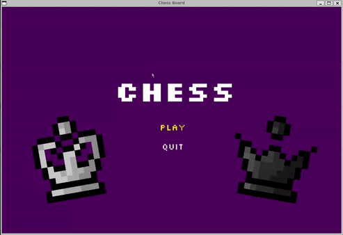

# CHESS BOARD 
A chess board written in C++ with the help of SFML (https://www.sfml-dev.org/). Hit me up if you are looking for an opponent :sunglasses:



## Dependencies
- CMake v3.13.4 &rarr;
- Compiler: GNU v11.4.0
- SFML-2.5.1 (included in the repo)

## Build instructions (Linux)
The project is compiled using CMake. Included is a bash script that handles the build process. The install script contains the following code:

```bash
#!/bin/sh

DIR="${PWD}/build"

# Create build path
if [ -d "$DIR" ]; then
  echo "Rebuilding..."
  rm -r build/*
else
  echo "New Build!"
  mkdir build
fi

# Build the program (CMake)
cmake CMakeLists.txt -B build
cd build
make
cd ..

# Execute the program
./chess
```

So, after making sure all dependencies are installed, the program is run by executing:
```
./install.sh
```

in the project root directory.

**NOTE!** If ure using WSL you'll have to setup an XServer to run a GUI application. Here's a quick guide on how to do just that: https://learn.microsoft.com/en-us/windows/wsl/tutorials/gui-apps